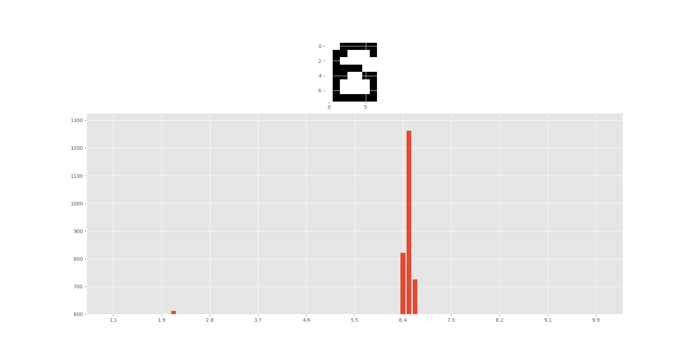

# pixel_comparison
Recognize image by comparing pixels

## Create Examples by
1. Hand write numbers 8x8 pixels. Save each file as x.n.png format. x = number, n = the # of the number 
2. Make a **root path**. Save the images under it.
3. Create a test.png file (also 8x8 pixels.png). Save under a **certain path**

In the example:
* root path = images\numbers\
* certain path = images\numbers\test.png

## Run model
1. If no img.db has ever been created
```
createExamples()
```
2. Run model.py
```
whatNumIsThis('images/numbers/test.png')
```

## Output
eg. put a 6.n.png:


## Built with
absl-py==0.8.0
antiorm==1.2.1
astor==0.8.0
astroid==2.2.5
colorama==0.4.1
cycler==0.10.0
db==0.1.1
gast==0.2.2
google-pasta==0.1.7
grpcio==1.24.1
h5py==2.10.0
isort==4.3.21
Keras-Applications==1.0.8
Keras-Preprocessing==1.1.0
kiwisolver==1.1.0
lazy-object-proxy==1.4.2
Markdown==3.1.1
matplotlib==3.1.1
mccabe==0.6.1
numpy==1.17.2
opt-einsum==3.1.0
protobuf==3.10.0
pylint==2.3.1
pyparsing==2.4.2
python-dateutil==2.8.0
six==1.12.0
tensorboard==2.0.0
tensorflow-estimator==2.0.0
termcolor==1.1.0
typed-ast==1.4.0
virtualenv==16.7.6
Werkzeug==0.16.0
wrapt==1.11.2
